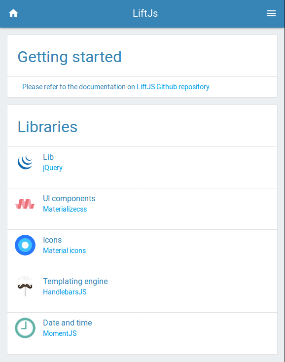

# LiftJS : Libre-Informatique Frontend Tool

A JavaScript frontend application developped with popular javascript / html / css libraries



[](./LICENCE.md)

## Third party libraries

- jQuery : https://jquery.com/
- MaterializeCss : http://materializecss.com/
- Material Icons : https://material.io/icons/
- HandlebarsJS : http://handlebarsjs.com/
- MomentJS : https://momentjs.com/

## Installation

### DEV env

```bash
$ cp data/parameters.json.dist data/parameters.json

// edit data/parameters.json with your environments configuration

$ npm install
$ gulp

// open localhost:8000, the window will refresh automatically and sass will be compiled every time you save a file in the project

```

### PROD env

```bash
$ cp data/parameters.json.dist data/parameters.json

// edit data/parameters.json with your environments configuration

$ npm install --production
$ ./node_modules/node-sass/bin/node-sass ./sass/ -o ./css/ 
```

## For developpers

### Add new view

Create your view template in views/myView.html directory.

```html
<div>
    My View ! and {{ myData }}
</div>
```

Append to index.php the script tag that holds your view template :

With AJAX template loading :

```html
<script id="myView-template" type="text/x-handlebars-template" src="views/myView.html"></script>
```

OR

With loading in index view :

```php
<script id="myView-template" type="text/x-handlebars-template"><?php echo file_get_contents("./views/myView.html"); ?></script>
```

Add action to js/core/controller.js (You should use a custom module instead of editing core's files,  see [Declare a custom module](#declare-a-custom-module) )

```js
app.register({
    ctrl: {
        myView: function () {
            app.core.ctrl.render('myView', {myData: 'myData'}, true);
        },
    }
});
```

Put the view placeholder in index.php

```html
<div id="app">

    <!-- [...] -->

    <handlebar-placeholder template="myView"></handlebar-placeholder>

    <!-- [...] -->

</div>
```

Add a link / button to call your newlly created view

```html
<a href='javascript:;' data-go="myView">
    Go to my new view !
</a>
```

### Declare a custom module

create your module file : js/modules/myModule.js

```js
app.register({
    myModule: {
        aProperty: null,
        aMethod: function() {
            alert('myModule myMethod !');
        },
    }
});
```

Include it in index.php between app.js (and core files) and app starter

```html
<!-- APP -->

<script type="text/javascript" src="js/app.js"></script>

<!-- [...] -->

<!-- MY CUSTOM MODULES -->

<script type="text/javascript" src="js/modules/myModule.js"></script>

<!-- APP STARTER -->

<script type="text/javascript">
    // START APP
    $(document).ready(app.init());
</script>
```

Your module is now available through `app.myModule`.

 Example of usage :

```js
console.info(app.myModule.aMethod());
```

### Custom module events

Modules can register their own events by declaring initEvents method :

```js
app.register({
    myModule: {
        initEvents: function() {
            $(document)
                .on('click','a',function() {
                    app.myModule.aMethod();
                });
        }
    }
});
```

### Custom module plugins

Modules can register their own third party plugins by declaring initPlugins method :

```js
app.register({
    myModule: {
        initPlugins: function() {
            // Example: init bootstrap tooltips
            $('[data-toggle="tooltip"]').tooltip(); 
        }
    }
});
```

your app.myModule.initPlugins() function will be called when all templates will be registered (event « templates.registered »), 
a template is applyed (event « templates.applyed ») or a popstate is applyed (via navigator history, event « history.popedstate »)

### Module and application override

Modules can override any part of methods / properties / module :

```js
app.register({
    myModule: {

    },

    ctrl: {
        myAction: function() {
            // Append new method to app.core.ctrl
            alert('Action called with app.ctrl.myAction()');
        },
        login : function() {
            // Override app.ctrl.login() action
            alert('Login Action overriden');
        }
    }
});
```
